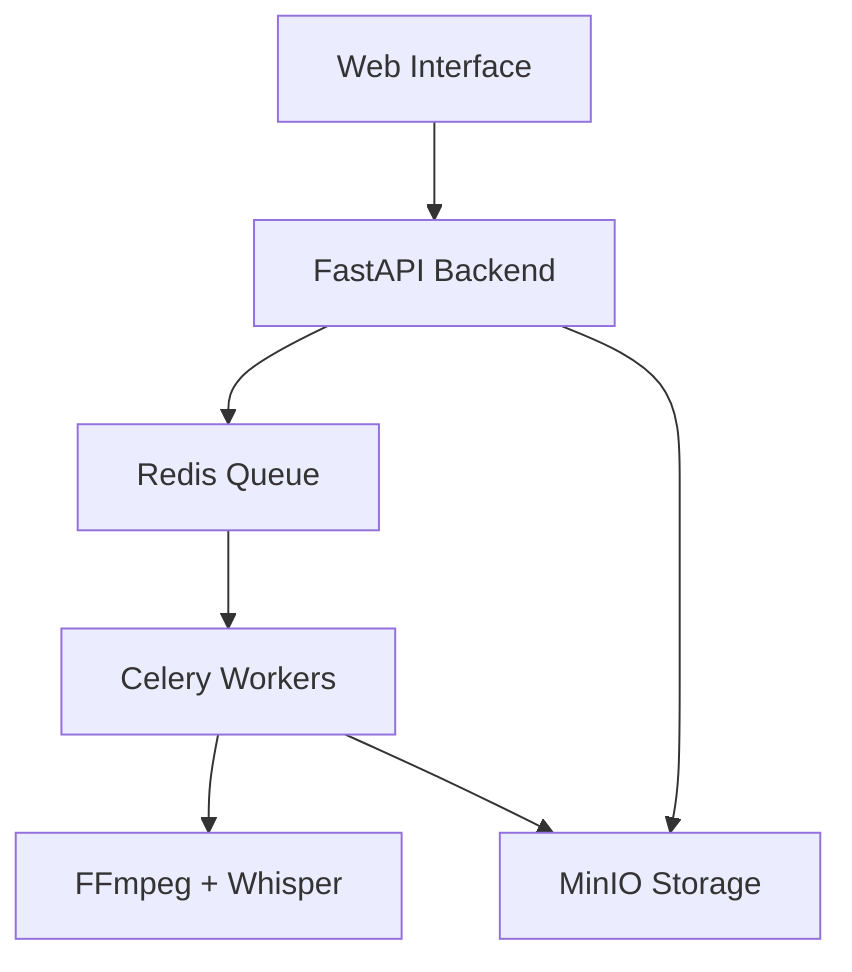

# 🎬 Subtitle Ninja

> **AI-Powered Video Subtitle Generator with Professional Styling**

Transform any video into engaging content with automatic AI transcription and professional subtitle styling. Built for content creators who need fast, high-quality results.

[](https://docker.com)
[](https://python.org)
[](https://fastapi.tiangolo.com)
[](https://openai.com/whisper)

## ✨ Features

### 🤖 **AI-Powered Transcription**
- **OpenAI Whisper Integration** - Automatic speech-to-text with 99%+ accuracy
- **Word-level timestamps** for precise subtitle timing
- **16x realtime processing** - 1 minute video processed in ~4 seconds
- **Multi-language support** with automatic detection

### 🎨 **Professional Styling Presets**
Choose from 5 professionally designed subtitle styles:

- **📱 Instagram Classic** - Clean white text with gold highlight accents
- **🔥 TikTok Viral** - Bold text with cyan glow effects for maximum engagement
- **🎥 YouTube Professional** - Red background highlights for clear readability
- **🎮 Gaming/Streamer** - Bold green glow with thick outlines for streaming
- **✨ Minimalist** - Subtle scale effects with soft color transitions

### 📐 **Smart Aspect Ratio Detection**
- **Automatic optimization** for vertical (9:16), horizontal (16:9), and square (1:1) videos
- **Platform-specific positioning** - optimized for Instagram Stories, YouTube, TikTok
- **No forced resizing** - maintains original video quality and dimensions

### ⚡ **Real-Time Processing**
- **Live progress tracking** with detailed status updates
- **Background processing** - upload and go, get notified when complete
- **Batch processing ready** for multiple videos (coming soon)

## 🚀 Quick Start

### Prerequisites
- **Docker & Docker Compose** ([Installation Guide](https://docs.docker.com/get-docker/))
- **4GB+ RAM** for optimal processing
- **Modern web browser** (Chrome, Firefox, Safari, Edge)

### 🐳 One-Command Setup

```bash
# Clone the repository
git clone https://github.com/CGStrategyLab/subtitle-ninja.git
cd subtitle-ninja

# Start all services (first run downloads AI models ~74MB)
docker-compose up --build -d

# Open your browser
open http://localhost:8000
```

**That's it!** 🎉 The application will be running at `http://localhost:8000`

### 📱 Using the Web Interface

1. **Select Style** - Choose from 5 professional presets
2. **Upload Video** - Drag & drop or click to select (MP4, AVI, MOV, MKV, WebM, FLV)
3. **Watch Progress** - Real-time updates during processing
4. **Download Result** - Get your styled video with burned-in subtitles

## 🏗️ Architecture

Subtitle Ninja uses a modern microservices architecture for scalability and reliability:



### 🛠️ Technology Stack

- **Frontend**: HTML5 + Vanilla JavaScript (responsive, mobile-friendly)
- **Backend**: FastAPI (Python 3.12) with async support
- **AI Processing**: OpenAI Whisper for transcription
- **Video Processing**: FFmpeg with Advanced SubStation Alpha (ASS) rendering
- **Job Queue**: Redis + Celery for background processing
- **Storage**: MinIO (S3-compatible) for reliable file handling
- **Containerization**: Docker Compose for easy deployment

## 📊 Performance

| Metric | Performance |
|--------|-------------|
| **Processing Speed** | ~16x realtime (1 min video = 4 sec processing) |
| **Model Size** | 74MB one-time download (Whisper base) |
| **Memory Usage** | 2-4GB RAM during processing |
| **Supported Formats** | MP4, AVI, MOV, MKV, WebM, FLV |
| **Output Quality** | Original resolution maintained |

## 🔧 Advanced Configuration

### Custom Styling
Subtitle styles are fully customizable through the `workflows/style_config.py` file. Each style supports:

- **Font families** and sizes
- **Color schemes** with gradients and transparency
- **Glow effects** and outlines
- **Animation timings** and transitions
- **Position adjustments** for different aspect ratios

### API Endpoints
Full API documentation available at `http://localhost:8000/docs` when running.

Key endpoints:
- `POST /upload` - Upload video with style selection
- `GET /status/{job_id}` - Check processing status
- `GET /download/{filename}` - Download processed video
- `GET /styles` - List available styling presets

## 🤝 Contributing

We welcome contributions! This project demonstrates modern AI-powered workflow automation patterns. See [CONTRIBUTING.md](CONTRIBUTING.md) for guidelines.

**Areas for contribution:**
- Additional subtitle styling presets
- Performance optimizations
- UI/UX improvements
- Documentation and tutorials

## 📖 Learn More

This project showcases practical AI implementation patterns and modern development practices. For more insights on building AI-powered workflows and automation strategies, check out:

- **[CG Strategy Lab](https://cgstrategylab.com)** - AI Insights and Strategy Platform
- **[Building AI Agent Frameworks](https://cgstrategylab.com/ai-agent-frameworks)** - Learn workflow automation patterns like those used in this project
- **[Local LLM Setup Guide](https://cgstrategylab.com/set-up-n8n-ollama-free-local-llms-laptop-10-mins)** - Extend this project with local AI capabilities

## 🔮 Roadmap

### v2.0 - Enhanced Styling
- [ ] Custom color picker for highlight colors
- [ ] More font options (Montserrat, Impact, Roboto)
- [ ] Style preview thumbnails
- [ ] Animation timing controls

### v3.0 - Advanced Features
- [ ] Batch processing for multiple videos
- [ ] Custom positioning and sizing controls
- [ ] Platform export presets (Instagram Stories, TikTok, YouTube Shorts)
- [ ] GPU acceleration support

### v4.0 - Collaboration Features
- [ ] User accounts and project management
- [ ] Team collaboration tools
- [ ] API access for integrations
- [ ] Advanced analytics

## 📄 License

MIT License - see [LICENSE](LICENSE) file for details.

## 🙏 Acknowledgments

- **OpenAI Whisper** for incredible speech recognition capabilities
- **FFmpeg** for powerful video processing
- **Docker** for consistent deployment across platforms
- **FastAPI** for modern Python web framework

---

## 🚨 Troubleshooting

### Common Issues

**Docker Issues:**
```bash
# Reset Docker environment
docker-compose down -v
docker-compose up --build -d
```

**Port Conflicts:**
- Web interface: Change port `8000:8000` to `8001:8000` in docker-compose.yml
- MinIO: Change ports `9000:9000` and `9001:9001` if needed

**Processing Errors:**
- Ensure video file is not corrupted
- Check available disk space (processing requires 2x video file size)
- Verify internet connection for initial Whisper model download

**Performance:**
- Close other applications to free up RAM
- Use smaller video files for testing
- Consider upgrading to faster storage (SSD recommended)

### Support

For technical questions and advanced implementation patterns:
- **Documentation**: Check our [troubleshooting guide](docs/TROUBLESHOOTING.md)
- **AI Strategy**: Visit [CG Strategy Lab](https://cgstrategylab.com) for workflow automation insights
- **Issues**: Report bugs via [GitHub Issues](https://github.com/CGStrategyLab/subtitle-ninja/issues)

---

<div align="center">

**Built with ❤️ for content creators and developers**

*Showcasing modern AI workflow automation and microservices architecture*

</div>